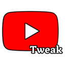

<div style="display: flex; align-items: center; justify-content: center; gap: 12px;">
    
    <h3>YouTube Tweaks</h3>
</div>

**YouTube Tweaks** is a lightweight browser extension crafted to improve your YouTube experience by offering handy customizations. Drawing inspiration from various open-source projects, this extension combines practical tweaks to tailor YouTube to your preferences.

## Features

- **Fake YouTube Premium Badge**: Display a premium badge for a customized look.
- **Return YouTube Dislike**: Bring back the dislike counter for videos.
- **Expand Theatre Mode**: Enhance the theatre mode for a better viewing experience.
- **Clean Share URL**: Generate cleaner, more shareable YouTube links.
- **Hide Ads**: Remove ads for uninterrupted viewing.
- **Remove Adblock Popup**: Bypass adblock detection popups.
- **Remove Confirm Dialog**: Skip confirmation dialogs for smoother navigation.

## Usage

- Access the extension's settings via the popup (click the extension icon in your browser toolbar).
- Toggle individual tweaks to customize your YouTube experience.
- Changes take effect immediately on YouTube pages.

## Project Structure

```
youtube-tweaks/
├── README.md           # 📘 Project documentation
├── package.json        # 📦 Project dependencies and scripts
├── RELEASE.md          # 📝 Release notes
├── webpack.config.js   # ⚙️ Webpack configuration for bundling
├── src/                # 🌐 Main source code of extension
│ ├── manifest.json     # 🔖 Extension manifest
│ ├── assets/           # 🎨 Fonts, icons, and libraries
│ ├── background/       # 🧠 Background script for extension logic
│ ├── content/          # 📄 Content scripts for YouTube page modifications
│ │ ├── core/           # 🧹 Core functionality
│ │ ├── tweaks/         # 🛠️ Individual tweak scripts
│ │ └── utils/          # 🧰 Utility scripts for DOM and YouTube checks
│ ├── popup/            # 🪟 Popup UI for settings
│ └── utils/            # 🔧 Additional utilities
└── .github/            # 🤖 GitHub Actions for automated releases
```

<h2>Credits</h2>
<ul>
    <li>
        <strong>Fake YouTube Premium Badge</strong>: Adapted from <a href="https://github.com/anubiskun/fake-youtube-premium-extension" target="_blank" rel="noopener noreferrer">fake-youtube-premium-extension</a> by <a href="https://github.com/anubiskun" target="_blank" rel="noopener noreferrer">anubiskun</a>.
    </li>
    <li>
        <strong>Return YouTube Dislike</strong>: Inspired by <a href="https://github.com/Anarios/return-youtube-dislike" target="_blank" rel="noopener noreferrer">return-youtube-dislike</a> by <a href="https://github.com/Anarios" target="_blank" rel="noopener noreferrer">Anarios</a>.
    </li>
     <li>
        <strong>Expand Theatre Mode</strong>: Adapted from <a href="https://github.com/SimenMH/better-youtube-theatre-mode" target="_blank" rel="noopener noreferrer">better-youtube-theatre-mode</a> by <a href="https://github.com/SimenMH" target="_blank" rel="noopener noreferrer">SimenMH</a>.
    </li>
</ul>
